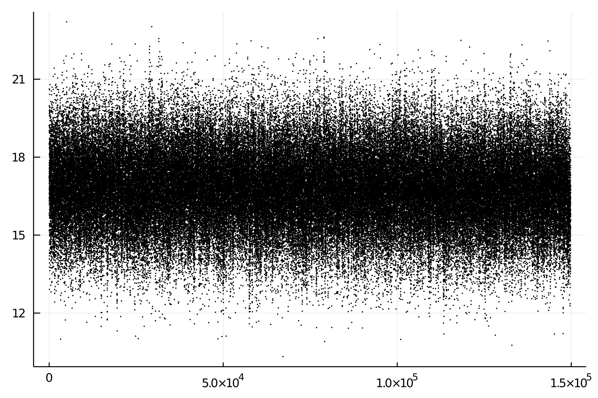

# Meeting 2021-Feb-05

## Problems
- without evaluation, 10 cycles use $500+s$
  - The first cycle:
    - ~8s dropping
    - ~9s writing.  Increase exponentially with generation.
- Dropping and merging take most of the time.
  - multiple tasking of dropping
  - in memory merging cross generation data.
- Evaluation will do too.
  - This, however, involves matrix operation
  - which is parallelized already.

## ToDo
- [x] Record pedigree
  - An **A** matrix maybe needed later
- [x] Merge data of multiple generations.
  - [x] just in memory.
  - Time $\sim 500+s \to \sim 100s$
  - peak 47.8G memory was (re)used. (~ half to GC)
    - may need to be optimized later.
- [x] Pedigree for merged data.  Recorded also.
- [x] A dispatch of function `random_mate` with extra ID vector as arg.
- [x] Change argument for binary trait from threshold to percentage.
  - handy `threshold = Statistics.quantile(ph, percentage)`.
- [x] Sample sex.
  - `:ped` $\Rightarrow$ [generation sex sire dam]

## ToDo cont-1
- [x] Select on
  - [x] TBV
  - [x] Phenotypes
- [ ] SNP-BLUP
- [ ] Add generation fixed effect in the model
- [ ] A short manual on how to develop GEAS as a co-author.
- [ ] Make the package ready for GE tweaks
- [ ] Parallelize `drop` function
  - Not urgent
  - may divide dropping into 10 tasks.
  - Dropping disk I/O saves most of the time.

## Another problem
- It may be better to define arrays first of max sizes, and fill later.
  - will pick up some speed also.
  - the program will be killed on a second run
    - because of unsafe genotype array copy / concatenation
    - no problem if run on generation_one 20 times
  - define first might solve the problem.
  - store them in a `DataFrame` for ease of operation later.
- [ ] Action: re-write the `breeding` part.

## Dicussions
### Julia can really ease coding, e.g.,
```julia
function select_nuclear(df, nSire, nDam)
    gp = groupby(df, :sex)	# df is DataFrame
    sires = last(sort(gp[1], :val), nSire).ID
    dams  = last(sort(gp[2], :val), nDam ).ID
    return [sires; dams]
end
```
### Memory management needs some techniques.

## Bug
- [x] Pedigree for ID with production phenotypes.
- [x] haplotype ($1\to 2$), and phenotype index ($1\to 1$).
  
## Final data structure


## Test-1
- Random selection and mating


## Test-2
- Selection on true breeding value


## Test-3
- Selection on phenotype

